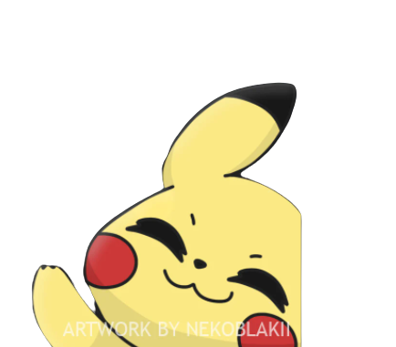

<h1>Heya </h1>

I'm Arnav aka Kiba ,a student at IIT Bhilai pursuing a degree in Electrical Engineering.  I love coding, reading manhwas and watching anime!

I have learnt a lot of stuff from FreeCodeCamp and would definitely recommend you the site as well. 
  I am a hardworker who would complete any assigned task. 

<a href="https://discord.com/users/769598708903051304">
  
<a href="https://www.freecodecamp.org/fcc09a0f031-81d9-47ad-8fd0-9dbe1b3167d9">
  
<a href="https://mail.google.com/mail/u/0/?view=cm&fs=1&to=arnavchauhan3175@gmail.com&tf=1">
  
 
  
### Languages & Technologies I use or have experience with

<!-- make img inline -->
<!-- Languages -->

